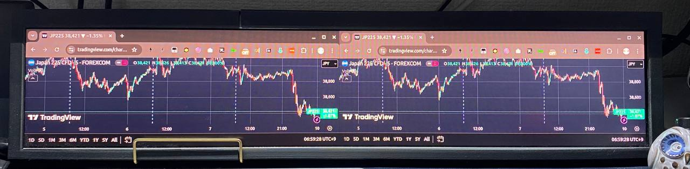
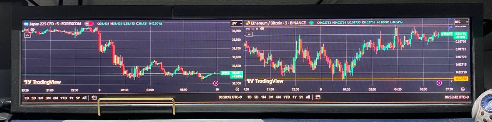

# Pane View

[](https://github.com/jiangzhuo/pane-view)

A modern window management tool built with Tauri.

## Features

- 🚀 Built with Tauri for optimal performance
- 📊 Flexible multi-pane layout supporting 1-4 views
- 🔄 Persistent web context with local data storage
- ⌨️ Keyboard shortcuts support (F11 for fullscreen toggle)
- 🖱️ Custom right-click menu handling
- 🎨 Modern split-pane interface
- 💻 Cross-platform support (Windows, macOS, Linux)
- ⚙️ Configurable URLs via TOML configuration

## Technical Details

### Window Management
- Dynamic split-pane layout supporting 1-4 views
- Automatic layout adjustment based on number of URLs:
  - 1 URL: Single view
  - 2 URLs: Horizontal split (2 columns)
  - 3 URLs: Horizontal split (3 columns)
  - 4 URLs: Grid layout (2x2)
- Automatic window resizing
- Fullscreen toggle support with F11 key

### Configuration
- User configuration stored in `~/.config/pane-view/config.toml`
- Customizable URLs via TOML configuration
- Default configuration includes TradingView charts

### Web Integration
- Unified web context across all panes
- Persistent data storage in `~/.config/pane-view/` (Linux)
- Custom JavaScript injection for UI customization

## Why Pane View?

Pane View transforms how you utilize your screen real estate for web content viewing:

### Before vs After

| Before | After |
|--------|-------|
|  |  |

#### Traditional Browser Limitations
- Screen space wasted by title bars and address bars
- Limited to displaying one window per screen in fullscreen mode
- Inefficient for information display scenarios

#### Pane View Advantages
- Clean, distraction-free interface with no title bars or address bars in fullscreen mode
- Display multiple web pages simultaneously
- Maximizes screen utilization
- Perfect for:
  - Information displays and dashboards
  - Trading and market monitoring
  - Multi-screen setups
  - Digital signage
  - Control room displays

## Tech Stack

- **Backend**: Rust + Tauri
- **Frontend**: HTML, CSS, JavaScript (Vanilla)
- **System Integration**:
  - WebKit2GTK
  - GTK
  - JavaScriptCore

## Development Setup

### Prerequisites

- [Rust](https://www.rust-lang.org/) (Latest stable version)
- System Dependencies:
  - Linux: WebKit2GTK and other GTK dependencies
  - macOS: Xcode Command Line Tools
  - Windows: Microsoft Visual Studio C++ Build Tools

### Recommended IDE Setup

- [VS Code](https://code.visualstudio.com/) 
  - [Tauri](https://marketplace.visualstudio.com/items?itemName=tauri-apps.tauri-vscode)
  - [rust-analyzer](https://marketplace.visualstudio.com/items?itemName=rust-lang.rust-analyzer)

## Getting Started

1. Clone the repository
```bash
git clone <repository-url>
cd pane-view
```

2. Install dependencies
```bash
# Install Rust dependencies
cargo check
```

3. Run development environment
```bash
cargo tauri dev
```

4. Build for production
```bash
cargo tauri build
```

## Project Structure

- `/src` - Frontend source code
- `/src-tauri` - Rust backend code
  - `src/lib.rs` - Core window management and webview integration
  - `src/main.rs` - Application entry point
  - `Cargo.toml` - Rust project configuration and dependencies

## Contributing

Pull Requests and Issues are welcome!

## License

[MIT License](LICENSE)
